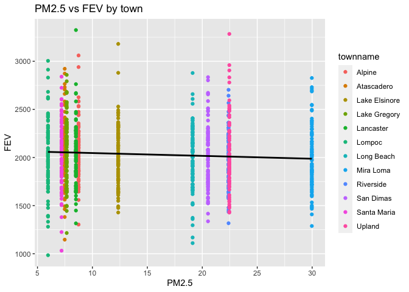

pm566_hw2
================
Yiping Li
2022-10-07

``` r
library (readr)
urlfile1="https://raw.githubusercontent.com/USCbiostats/data-science-data/master/01_chs/chs_individual.csv"
individual <- read_csv(url(urlfile1))
```

    ## Rows: 1200 Columns: 23
    ## ── Column specification ────────────────────────────────────────────────────────
    ## Delimiter: ","
    ## chr  (2): townname, race
    ## dbl (21): sid, male, hispanic, agepft, height, weight, bmi, asthma, active_a...
    ## 
    ## ℹ Use `spec()` to retrieve the full column specification for this data.
    ## ℹ Specify the column types or set `show_col_types = FALSE` to quiet this message.

``` r
dim(individual)
```

    ## [1] 1200   23

``` r
summary(individual)
```

    ##       sid           townname              male            race          
    ##  Min.   :   1.0   Length:1200        Min.   :0.0000   Length:1200       
    ##  1st Qu.: 528.8   Class :character   1st Qu.:0.0000   Class :character  
    ##  Median :1041.5   Mode  :character   Median :0.0000   Mode  :character  
    ##  Mean   :1037.5                      Mean   :0.4917                     
    ##  3rd Qu.:1554.2                      3rd Qu.:1.0000                     
    ##  Max.   :2053.0                      Max.   :1.0000                     
    ##                                                                         
    ##     hispanic          agepft           height        weight      
    ##  Min.   :0.0000   Min.   : 8.961   Min.   :114   Min.   : 42.00  
    ##  1st Qu.:0.0000   1st Qu.: 9.610   1st Qu.:135   1st Qu.: 65.00  
    ##  Median :0.0000   Median : 9.906   Median :139   Median : 74.00  
    ##  Mean   :0.4342   Mean   : 9.924   Mean   :139   Mean   : 79.33  
    ##  3rd Qu.:1.0000   3rd Qu.:10.177   3rd Qu.:143   3rd Qu.: 89.00  
    ##  Max.   :1.0000   Max.   :12.731   Max.   :165   Max.   :207.00  
    ##                   NA's   :89       NA's   :89    NA's   :89      
    ##       bmi            asthma       active_asthma  father_asthma    
    ##  Min.   :11.30   Min.   :0.0000   Min.   :0.00   Min.   :0.00000  
    ##  1st Qu.:15.78   1st Qu.:0.0000   1st Qu.:0.00   1st Qu.:0.00000  
    ##  Median :17.48   Median :0.0000   Median :0.00   Median :0.00000  
    ##  Mean   :18.50   Mean   :0.1463   Mean   :0.19   Mean   :0.08318  
    ##  3rd Qu.:20.35   3rd Qu.:0.0000   3rd Qu.:0.00   3rd Qu.:0.00000  
    ##  Max.   :41.27   Max.   :1.0000   Max.   :1.00   Max.   :1.00000  
    ##  NA's   :89      NA's   :31                      NA's   :106      
    ##  mother_asthma        wheeze          hayfever         allergy      
    ##  Min.   :0.0000   Min.   :0.0000   Min.   :0.0000   Min.   :0.0000  
    ##  1st Qu.:0.0000   1st Qu.:0.0000   1st Qu.:0.0000   1st Qu.:0.0000  
    ##  Median :0.0000   Median :0.0000   Median :0.0000   Median :0.0000  
    ##  Mean   :0.1023   Mean   :0.3313   Mean   :0.1747   Mean   :0.2929  
    ##  3rd Qu.:0.0000   3rd Qu.:1.0000   3rd Qu.:0.0000   3rd Qu.:1.0000  
    ##  Max.   :1.0000   Max.   :1.0000   Max.   :1.0000   Max.   :1.0000  
    ##  NA's   :56       NA's   :71       NA's   :118      NA's   :63      
    ##   educ_parent        smoke             pets           gasstove     
    ##  Min.   :1.000   Min.   :0.0000   Min.   :0.0000   Min.   :0.0000  
    ##  1st Qu.:2.000   1st Qu.:0.0000   1st Qu.:1.0000   1st Qu.:1.0000  
    ##  Median :3.000   Median :0.0000   Median :1.0000   Median :1.0000  
    ##  Mean   :2.797   Mean   :0.1638   Mean   :0.7667   Mean   :0.7815  
    ##  3rd Qu.:3.000   3rd Qu.:0.0000   3rd Qu.:1.0000   3rd Qu.:1.0000  
    ##  Max.   :5.000   Max.   :1.0000   Max.   :1.0000   Max.   :1.0000  
    ##  NA's   :64      NA's   :40                        NA's   :33      
    ##       fev              fvc            mmef       
    ##  Min.   : 984.8   Min.   : 895   Min.   : 757.6  
    ##  1st Qu.:1809.0   1st Qu.:2041   1st Qu.:1994.0  
    ##  Median :2022.7   Median :2293   Median :2401.5  
    ##  Mean   :2031.3   Mean   :2324   Mean   :2398.8  
    ##  3rd Qu.:2249.7   3rd Qu.:2573   3rd Qu.:2793.8  
    ##  Max.   :3323.7   Max.   :3698   Max.   :4935.9  
    ##  NA's   :95       NA's   :97     NA's   :106

``` r
urlfile2="https://raw.githubusercontent.com/USCbiostats/data-science-data/master/01_chs/chs_regional.csv"
regional <- read_csv(url(urlfile2))
```

    ## Rows: 12 Columns: 27
    ## ── Column specification ────────────────────────────────────────────────────────
    ## Delimiter: ","
    ## chr  (1): townname
    ## dbl (26): pm25_mass, pm25_so4, pm25_no3, pm25_nh4, pm25_oc, pm25_ec, pm25_om...
    ## 
    ## ℹ Use `spec()` to retrieve the full column specification for this data.
    ## ℹ Specify the column types or set `show_col_types = FALSE` to quiet this message.

``` r
dim(regional)
```

    ## [1] 12 27

``` r
summary(regional)
```

    ##    townname           pm25_mass         pm25_so4        pm25_no3     
    ##  Length:12          Min.   : 5.960   Min.   :0.790   Min.   : 0.730  
    ##  Class :character   1st Qu.: 7.615   1st Qu.:1.077   1st Qu.: 1.538  
    ##  Mode  :character   Median :10.545   Median :1.815   Median : 2.525  
    ##                     Mean   :14.362   Mean   :1.876   Mean   : 4.488  
    ##                     3rd Qu.:20.988   3rd Qu.:2.605   3rd Qu.: 7.338  
    ##                     Max.   :29.970   Max.   :3.230   Max.   :12.200  
    ##                                                                      
    ##     pm25_nh4         pm25_oc          pm25_ec          pm25_om      
    ##  Min.   :0.4100   Min.   : 1.450   Min.   :0.1300   Min.   : 1.740  
    ##  1st Qu.:0.7375   1st Qu.: 2.520   1st Qu.:0.4000   1st Qu.: 3.020  
    ##  Median :1.1350   Median : 4.035   Median :0.5850   Median : 4.840  
    ##  Mean   :1.7642   Mean   : 4.551   Mean   :0.7358   Mean   : 5.460  
    ##  3rd Qu.:2.7725   3rd Qu.: 5.350   3rd Qu.:1.1750   3rd Qu.: 6.418  
    ##  Max.   :4.2500   Max.   :11.830   Max.   :1.3600   Max.   :14.200  
    ##                                                                     
    ##     pm10_oc          pm10_ec          pm10_tc           formic     
    ##  Min.   : 1.860   Min.   :0.1400   Min.   : 1.990   Min.   :0.340  
    ##  1st Qu.: 3.228   1st Qu.:0.4100   1st Qu.: 3.705   1st Qu.:0.720  
    ##  Median : 5.170   Median :0.5950   Median : 6.505   Median :1.105  
    ##  Mean   : 5.832   Mean   :0.7525   Mean   : 6.784   Mean   :1.332  
    ##  3rd Qu.: 6.855   3rd Qu.:1.1975   3rd Qu.: 8.430   3rd Qu.:1.765  
    ##  Max.   :15.160   Max.   :1.3900   Max.   :16.440   Max.   :2.770  
    ##                                                                    
    ##      acetic           hcl              hno3           o3_max     
    ##  Min.   :0.750   Min.   :0.2200   Min.   :0.430   Min.   :38.27  
    ##  1st Qu.:2.297   1st Qu.:0.3250   1st Qu.:1.593   1st Qu.:49.93  
    ##  Median :2.910   Median :0.4350   Median :2.455   Median :64.05  
    ##  Mean   :3.010   Mean   :0.4208   Mean   :2.367   Mean   :60.16  
    ##  3rd Qu.:4.000   3rd Qu.:0.4625   3rd Qu.:3.355   3rd Qu.:67.69  
    ##  Max.   :5.140   Max.   :0.7300   Max.   :4.070   Max.   :84.44  
    ##                                                                  
    ##      o3106           o3_24            no2             pm10      
    ##  Min.   :28.22   Min.   :18.22   Min.   : 4.60   Min.   :18.40  
    ##  1st Qu.:41.90   1st Qu.:23.31   1st Qu.:12.12   1st Qu.:20.71  
    ##  Median :46.74   Median :27.59   Median :16.40   Median :29.64  
    ##  Mean   :47.76   Mean   :30.23   Mean   :18.99   Mean   :32.64  
    ##  3rd Qu.:55.24   3rd Qu.:32.39   3rd Qu.:23.24   3rd Qu.:39.16  
    ##  Max.   :67.01   Max.   :57.76   Max.   :37.97   Max.   :70.39  
    ##                                                                 
    ##     no_24hr          pm2_5_fr         iacid           oacid      
    ##  Min.   : 2.050   Min.   : 9.01   Min.   :0.760   Min.   :1.090  
    ##  1st Qu.: 5.905   1st Qu.:10.28   1st Qu.:1.835   1st Qu.:2.978  
    ##  Median :12.680   Median :22.23   Median :2.825   Median :4.135  
    ##  Mean   :16.209   Mean   :19.79   Mean   :2.788   Mean   :4.342  
    ##  3rd Qu.:22.690   3rd Qu.:27.73   3rd Qu.:3.817   3rd Qu.:5.982  
    ##  Max.   :42.950   Max.   :31.55   Max.   :4.620   Max.   :7.400  
    ##  NA's   :1        NA's   :3                                      
    ##   total_acids          lon              lat       
    ##  Min.   : 1.520   Min.   :-120.7   Min.   :32.84  
    ##  1st Qu.: 4.930   1st Qu.:-118.8   1st Qu.:33.93  
    ##  Median : 6.370   Median :-117.7   Median :34.10  
    ##  Mean   : 6.708   Mean   :-118.3   Mean   :34.20  
    ##  3rd Qu.: 9.395   3rd Qu.:-117.4   3rd Qu.:34.65  
    ##  Max.   :11.430   Max.   :-116.8   Max.   :35.49  
    ## 

``` r
hw2 <- merge(individual, regional)
dim(hw2)
```

    ## [1] 1200   49

``` r
head(hw2)
```

    ##   townname sid male race hispanic    agepft height weight      bmi asthma
    ## 1   Alpine 841    1    W        1 10.548939    150     78 15.75758      0
    ## 2   Alpine 835    0    W        0 10.099932    143     69 15.33749      0
    ## 3   Alpine 838    0    O        1  9.486653    133     62 15.93183      0
    ## 4   Alpine 840    0    W        0  9.965777    146     78 16.63283      0
    ## 5   Alpine 865    0    W        0 10.039699    162    140 24.24797      1
    ## 6   Alpine 867    0    W        1  9.957563    141     94 21.49151      0
    ##   active_asthma father_asthma mother_asthma wheeze hayfever allergy educ_parent
    ## 1             0             0             0      0        0       0           5
    ## 2             0             0             0      0        0       1           3
    ## 3             0             0             0      0        0       0           4
    ## 4             0             0             0      0        0       0          NA
    ## 5             1             0             0      1        0       1           3
    ## 6             0            NA             0      0        0       0           5
    ##   smoke pets gasstove      fev      fvc     mmef pm25_mass pm25_so4 pm25_no3
    ## 1     0    1        0 2251.505 2594.649 2445.151      8.74     1.73     1.59
    ## 2     0    1        0 2529.276 2826.316 3406.579      8.74     1.73     1.59
    ## 3    NA    1        0 1737.793 1963.545 2133.110      8.74     1.73     1.59
    ## 4    NA    0       NA 2466.791 2638.221 3466.464      8.74     1.73     1.59
    ## 5     0    1        1 2583.934 3567.541 2071.475      8.74     1.73     1.59
    ## 6     0    1        1 1973.115 2154.098 2690.164      8.74     1.73     1.59
    ##   pm25_nh4 pm25_oc pm25_ec pm25_om pm10_oc pm10_ec pm10_tc formic acetic  hcl
    ## 1     0.88    2.54    0.48    3.04    3.25    0.49    3.75   1.03   2.49 0.41
    ## 2     0.88    2.54    0.48    3.04    3.25    0.49    3.75   1.03   2.49 0.41
    ## 3     0.88    2.54    0.48    3.04    3.25    0.49    3.75   1.03   2.49 0.41
    ## 4     0.88    2.54    0.48    3.04    3.25    0.49    3.75   1.03   2.49 0.41
    ## 5     0.88    2.54    0.48    3.04    3.25    0.49    3.75   1.03   2.49 0.41
    ## 6     0.88    2.54    0.48    3.04    3.25    0.49    3.75   1.03   2.49 0.41
    ##   hno3 o3_max o3106 o3_24   no2  pm10 no_24hr pm2_5_fr iacid oacid total_acids
    ## 1 1.98  65.82 55.05 41.23 12.18 24.73    2.48    10.28  2.39  3.52         5.5
    ## 2 1.98  65.82 55.05 41.23 12.18 24.73    2.48    10.28  2.39  3.52         5.5
    ## 3 1.98  65.82 55.05 41.23 12.18 24.73    2.48    10.28  2.39  3.52         5.5
    ## 4 1.98  65.82 55.05 41.23 12.18 24.73    2.48    10.28  2.39  3.52         5.5
    ## 5 1.98  65.82 55.05 41.23 12.18 24.73    2.48    10.28  2.39  3.52         5.5
    ## 6 1.98  65.82 55.05 41.23 12.18 24.73    2.48    10.28  2.39  3.52         5.5
    ##         lon      lat
    ## 1 -116.7664 32.83505
    ## 2 -116.7664 32.83505
    ## 3 -116.7664 32.83505
    ## 4 -116.7664 32.83505
    ## 5 -116.7664 32.83505
    ## 6 -116.7664 32.83505

``` r
tail(hw2)
```

    ##      townname  sid male race hispanic    agepft height weight      bmi asthma
    ## 1195   Upland 1866    0    O        1  9.806982    139     60 14.11559      0
    ## 1196   Upland 1867    0    M        1  9.618070    140     71 16.46568      0
    ## 1197   Upland 2033    0    M        0 10.121834    130     67 18.02044      0
    ## 1198   Upland 2031    1    W        0  9.798768    135     83 20.70084      0
    ## 1199   Upland 2032    1    W        0  9.549624    137     59 14.28855      0
    ## 1200   Upland 2053    0    W        0        NA     NA     NA       NA      0
    ##      active_asthma father_asthma mother_asthma wheeze hayfever allergy
    ## 1195             0            NA             0      0       NA      NA
    ## 1196             0             1             0      0        0       0
    ## 1197             1             0             0      1        1       0
    ## 1198             0             0             0      1        0       1
    ## 1199             0             0             1      1        1       1
    ## 1200             0             0             0      0        0       0
    ##      educ_parent smoke pets gasstove      fev      fvc     mmef pm25_mass
    ## 1195           3     0    1        0 1691.275 1928.859 1890.604     22.46
    ## 1196           3     0    1        0 1733.338 1993.040 2072.643     22.46
    ## 1197           3     0    1        1 1929.866 2122.148 2558.054     22.46
    ## 1198           3     0    1        1 2034.177 2505.535 1814.075     22.46
    ## 1199           3     0    1        1 2077.703 2275.338 2706.081     22.46
    ## 1200           3     0    1        0       NA       NA       NA     22.46
    ##      pm25_so4 pm25_no3 pm25_nh4 pm25_oc pm25_ec pm25_om pm10_oc pm10_ec pm10_tc
    ## 1195     2.65     7.75     2.96    6.49    1.19    7.79    8.32    1.22    9.54
    ## 1196     2.65     7.75     2.96    6.49    1.19    7.79    8.32    1.22    9.54
    ## 1197     2.65     7.75     2.96    6.49    1.19    7.79    8.32    1.22    9.54
    ## 1198     2.65     7.75     2.96    6.49    1.19    7.79    8.32    1.22    9.54
    ## 1199     2.65     7.75     2.96    6.49    1.19    7.79    8.32    1.22    9.54
    ## 1200     2.65     7.75     2.96    6.49    1.19    7.79    8.32    1.22    9.54
    ##      formic acetic  hcl hno3 o3_max o3106 o3_24   no2 pm10 no_24hr pm2_5_fr
    ## 1195   2.67   4.73 0.46 4.03  63.83  46.5  22.2 37.97 40.8   18.48    27.73
    ## 1196   2.67   4.73 0.46 4.03  63.83  46.5  22.2 37.97 40.8   18.48    27.73
    ## 1197   2.67   4.73 0.46 4.03  63.83  46.5  22.2 37.97 40.8   18.48    27.73
    ## 1198   2.67   4.73 0.46 4.03  63.83  46.5  22.2 37.97 40.8   18.48    27.73
    ## 1199   2.67   4.73 0.46 4.03  63.83  46.5  22.2 37.97 40.8   18.48    27.73
    ## 1200   2.67   4.73 0.46 4.03  63.83  46.5  22.2 37.97 40.8   18.48    27.73
    ##      iacid oacid total_acids       lon      lat
    ## 1195  4.49   7.4       11.43 -117.6484 34.09751
    ## 1196  4.49   7.4       11.43 -117.6484 34.09751
    ## 1197  4.49   7.4       11.43 -117.6484 34.09751
    ## 1198  4.49   7.4       11.43 -117.6484 34.09751
    ## 1199  4.49   7.4       11.43 -117.6484 34.09751
    ## 1200  4.49   7.4       11.43 -117.6484 34.09751

``` r
str(hw2)
```

    ## 'data.frame':    1200 obs. of  49 variables:
    ##  $ townname     : chr  "Alpine" "Alpine" "Alpine" "Alpine" ...
    ##  $ sid          : num  841 835 838 840 865 867 842 839 844 847 ...
    ##  $ male         : num  1 0 0 0 0 0 1 0 1 1 ...
    ##  $ race         : chr  "W" "W" "O" "W" ...
    ##  $ hispanic     : num  1 0 1 0 0 1 1 1 1 0 ...
    ##  $ agepft       : num  10.55 10.1 9.49 9.97 10.04 ...
    ##  $ height       : num  150 143 133 146 162 141 139 142 143 137 ...
    ##  $ weight       : num  78 69 62 78 140 94 65 86 65 69 ...
    ##  $ bmi          : num  15.8 15.3 15.9 16.6 24.2 ...
    ##  $ asthma       : num  0 0 0 0 1 0 0 0 NA 0 ...
    ##  $ active_asthma: num  0 0 0 0 1 0 0 0 0 0 ...
    ##  $ father_asthma: num  0 0 0 0 0 NA 0 0 NA 0 ...
    ##  $ mother_asthma: num  0 0 0 0 0 0 0 1 NA 0 ...
    ##  $ wheeze       : num  0 0 0 0 1 0 1 1 NA 0 ...
    ##  $ hayfever     : num  0 0 0 0 0 0 0 1 NA 0 ...
    ##  $ allergy      : num  0 1 0 0 1 0 0 1 NA 0 ...
    ##  $ educ_parent  : num  5 3 4 NA 3 5 1 3 NA 5 ...
    ##  $ smoke        : num  0 0 NA NA 0 0 1 1 NA 0 ...
    ##  $ pets         : num  1 1 1 0 1 1 1 1 0 1 ...
    ##  $ gasstove     : num  0 0 0 NA 1 1 0 0 NA 1 ...
    ##  $ fev          : num  2252 2529 1738 2467 2584 ...
    ##  $ fvc          : num  2595 2826 1964 2638 3568 ...
    ##  $ mmef         : num  2445 3407 2133 3466 2071 ...
    ##  $ pm25_mass    : num  8.74 8.74 8.74 8.74 8.74 8.74 8.74 8.74 8.74 8.74 ...
    ##  $ pm25_so4     : num  1.73 1.73 1.73 1.73 1.73 1.73 1.73 1.73 1.73 1.73 ...
    ##  $ pm25_no3     : num  1.59 1.59 1.59 1.59 1.59 1.59 1.59 1.59 1.59 1.59 ...
    ##  $ pm25_nh4     : num  0.88 0.88 0.88 0.88 0.88 0.88 0.88 0.88 0.88 0.88 ...
    ##  $ pm25_oc      : num  2.54 2.54 2.54 2.54 2.54 2.54 2.54 2.54 2.54 2.54 ...
    ##  $ pm25_ec      : num  0.48 0.48 0.48 0.48 0.48 0.48 0.48 0.48 0.48 0.48 ...
    ##  $ pm25_om      : num  3.04 3.04 3.04 3.04 3.04 3.04 3.04 3.04 3.04 3.04 ...
    ##  $ pm10_oc      : num  3.25 3.25 3.25 3.25 3.25 3.25 3.25 3.25 3.25 3.25 ...
    ##  $ pm10_ec      : num  0.49 0.49 0.49 0.49 0.49 0.49 0.49 0.49 0.49 0.49 ...
    ##  $ pm10_tc      : num  3.75 3.75 3.75 3.75 3.75 3.75 3.75 3.75 3.75 3.75 ...
    ##  $ formic       : num  1.03 1.03 1.03 1.03 1.03 1.03 1.03 1.03 1.03 1.03 ...
    ##  $ acetic       : num  2.49 2.49 2.49 2.49 2.49 2.49 2.49 2.49 2.49 2.49 ...
    ##  $ hcl          : num  0.41 0.41 0.41 0.41 0.41 0.41 0.41 0.41 0.41 0.41 ...
    ##  $ hno3         : num  1.98 1.98 1.98 1.98 1.98 1.98 1.98 1.98 1.98 1.98 ...
    ##  $ o3_max       : num  65.8 65.8 65.8 65.8 65.8 ...
    ##  $ o3106        : num  55 55 55 55 55 ...
    ##  $ o3_24        : num  41.2 41.2 41.2 41.2 41.2 ...
    ##  $ no2          : num  12.2 12.2 12.2 12.2 12.2 ...
    ##  $ pm10         : num  24.7 24.7 24.7 24.7 24.7 ...
    ##  $ no_24hr      : num  2.48 2.48 2.48 2.48 2.48 2.48 2.48 2.48 2.48 2.48 ...
    ##  $ pm2_5_fr     : num  10.3 10.3 10.3 10.3 10.3 ...
    ##  $ iacid        : num  2.39 2.39 2.39 2.39 2.39 2.39 2.39 2.39 2.39 2.39 ...
    ##  $ oacid        : num  3.52 3.52 3.52 3.52 3.52 3.52 3.52 3.52 3.52 3.52 ...
    ##  $ total_acids  : num  5.5 5.5 5.5 5.5 5.5 5.5 5.5 5.5 5.5 5.5 ...
    ##  $ lon          : num  -117 -117 -117 -117 -117 ...
    ##  $ lat          : num  32.8 32.8 32.8 32.8 32.8 ...

``` r
summary(hw2)
```

    ##    townname              sid              male            race          
    ##  Length:1200        Min.   :   1.0   Min.   :0.0000   Length:1200       
    ##  Class :character   1st Qu.: 528.8   1st Qu.:0.0000   Class :character  
    ##  Mode  :character   Median :1041.5   Median :0.0000   Mode  :character  
    ##                     Mean   :1037.5   Mean   :0.4917                     
    ##                     3rd Qu.:1554.2   3rd Qu.:1.0000                     
    ##                     Max.   :2053.0   Max.   :1.0000                     
    ##                                                                         
    ##     hispanic          agepft           height        weight      
    ##  Min.   :0.0000   Min.   : 8.961   Min.   :114   Min.   : 42.00  
    ##  1st Qu.:0.0000   1st Qu.: 9.610   1st Qu.:135   1st Qu.: 65.00  
    ##  Median :0.0000   Median : 9.906   Median :139   Median : 74.00  
    ##  Mean   :0.4342   Mean   : 9.924   Mean   :139   Mean   : 79.33  
    ##  3rd Qu.:1.0000   3rd Qu.:10.177   3rd Qu.:143   3rd Qu.: 89.00  
    ##  Max.   :1.0000   Max.   :12.731   Max.   :165   Max.   :207.00  
    ##                   NA's   :89       NA's   :89    NA's   :89      
    ##       bmi            asthma       active_asthma  father_asthma    
    ##  Min.   :11.30   Min.   :0.0000   Min.   :0.00   Min.   :0.00000  
    ##  1st Qu.:15.78   1st Qu.:0.0000   1st Qu.:0.00   1st Qu.:0.00000  
    ##  Median :17.48   Median :0.0000   Median :0.00   Median :0.00000  
    ##  Mean   :18.50   Mean   :0.1463   Mean   :0.19   Mean   :0.08318  
    ##  3rd Qu.:20.35   3rd Qu.:0.0000   3rd Qu.:0.00   3rd Qu.:0.00000  
    ##  Max.   :41.27   Max.   :1.0000   Max.   :1.00   Max.   :1.00000  
    ##  NA's   :89      NA's   :31                      NA's   :106      
    ##  mother_asthma        wheeze          hayfever         allergy      
    ##  Min.   :0.0000   Min.   :0.0000   Min.   :0.0000   Min.   :0.0000  
    ##  1st Qu.:0.0000   1st Qu.:0.0000   1st Qu.:0.0000   1st Qu.:0.0000  
    ##  Median :0.0000   Median :0.0000   Median :0.0000   Median :0.0000  
    ##  Mean   :0.1023   Mean   :0.3313   Mean   :0.1747   Mean   :0.2929  
    ##  3rd Qu.:0.0000   3rd Qu.:1.0000   3rd Qu.:0.0000   3rd Qu.:1.0000  
    ##  Max.   :1.0000   Max.   :1.0000   Max.   :1.0000   Max.   :1.0000  
    ##  NA's   :56       NA's   :71       NA's   :118      NA's   :63      
    ##   educ_parent        smoke             pets           gasstove     
    ##  Min.   :1.000   Min.   :0.0000   Min.   :0.0000   Min.   :0.0000  
    ##  1st Qu.:2.000   1st Qu.:0.0000   1st Qu.:1.0000   1st Qu.:1.0000  
    ##  Median :3.000   Median :0.0000   Median :1.0000   Median :1.0000  
    ##  Mean   :2.797   Mean   :0.1638   Mean   :0.7667   Mean   :0.7815  
    ##  3rd Qu.:3.000   3rd Qu.:0.0000   3rd Qu.:1.0000   3rd Qu.:1.0000  
    ##  Max.   :5.000   Max.   :1.0000   Max.   :1.0000   Max.   :1.0000  
    ##  NA's   :64      NA's   :40                        NA's   :33      
    ##       fev              fvc            mmef          pm25_mass     
    ##  Min.   : 984.8   Min.   : 895   Min.   : 757.6   Min.   : 5.960  
    ##  1st Qu.:1809.0   1st Qu.:2041   1st Qu.:1994.0   1st Qu.: 7.615  
    ##  Median :2022.7   Median :2293   Median :2401.5   Median :10.545  
    ##  Mean   :2031.3   Mean   :2324   Mean   :2398.8   Mean   :14.362  
    ##  3rd Qu.:2249.7   3rd Qu.:2573   3rd Qu.:2793.8   3rd Qu.:20.988  
    ##  Max.   :3323.7   Max.   :3698   Max.   :4935.9   Max.   :29.970  
    ##  NA's   :95       NA's   :97     NA's   :106                      
    ##     pm25_so4        pm25_no3         pm25_nh4         pm25_oc      
    ##  Min.   :0.790   Min.   : 0.730   Min.   :0.4100   Min.   : 1.450  
    ##  1st Qu.:1.077   1st Qu.: 1.538   1st Qu.:0.7375   1st Qu.: 2.520  
    ##  Median :1.815   Median : 2.525   Median :1.1350   Median : 4.035  
    ##  Mean   :1.876   Mean   : 4.488   Mean   :1.7642   Mean   : 4.551  
    ##  3rd Qu.:2.605   3rd Qu.: 7.338   3rd Qu.:2.7725   3rd Qu.: 5.350  
    ##  Max.   :3.230   Max.   :12.200   Max.   :4.2500   Max.   :11.830  
    ##                                                                    
    ##     pm25_ec          pm25_om          pm10_oc          pm10_ec      
    ##  Min.   :0.1300   Min.   : 1.740   Min.   : 1.860   Min.   :0.1400  
    ##  1st Qu.:0.4000   1st Qu.: 3.020   1st Qu.: 3.228   1st Qu.:0.4100  
    ##  Median :0.5850   Median : 4.840   Median : 5.170   Median :0.5950  
    ##  Mean   :0.7358   Mean   : 5.460   Mean   : 5.832   Mean   :0.7525  
    ##  3rd Qu.:1.1750   3rd Qu.: 6.418   3rd Qu.: 6.855   3rd Qu.:1.1975  
    ##  Max.   :1.3600   Max.   :14.200   Max.   :15.160   Max.   :1.3900  
    ##                                                                     
    ##     pm10_tc           formic          acetic           hcl        
    ##  Min.   : 1.990   Min.   :0.340   Min.   :0.750   Min.   :0.2200  
    ##  1st Qu.: 3.705   1st Qu.:0.720   1st Qu.:2.297   1st Qu.:0.3250  
    ##  Median : 6.505   Median :1.105   Median :2.910   Median :0.4350  
    ##  Mean   : 6.784   Mean   :1.332   Mean   :3.010   Mean   :0.4208  
    ##  3rd Qu.: 8.430   3rd Qu.:1.765   3rd Qu.:4.000   3rd Qu.:0.4625  
    ##  Max.   :16.440   Max.   :2.770   Max.   :5.140   Max.   :0.7300  
    ##                                                                   
    ##       hno3           o3_max          o3106           o3_24      
    ##  Min.   :0.430   Min.   :38.27   Min.   :28.22   Min.   :18.22  
    ##  1st Qu.:1.593   1st Qu.:49.93   1st Qu.:41.90   1st Qu.:23.31  
    ##  Median :2.455   Median :64.05   Median :46.74   Median :27.59  
    ##  Mean   :2.367   Mean   :60.16   Mean   :47.76   Mean   :30.23  
    ##  3rd Qu.:3.355   3rd Qu.:67.69   3rd Qu.:55.24   3rd Qu.:32.39  
    ##  Max.   :4.070   Max.   :84.44   Max.   :67.01   Max.   :57.76  
    ##                                                                 
    ##       no2             pm10          no_24hr         pm2_5_fr    
    ##  Min.   : 4.60   Min.   :18.40   Min.   : 2.05   Min.   : 9.01  
    ##  1st Qu.:12.12   1st Qu.:20.71   1st Qu.: 4.74   1st Qu.:10.28  
    ##  Median :16.40   Median :29.64   Median :12.68   Median :22.23  
    ##  Mean   :18.99   Mean   :32.64   Mean   :16.21   Mean   :19.79  
    ##  3rd Qu.:23.24   3rd Qu.:39.16   3rd Qu.:26.90   3rd Qu.:27.73  
    ##  Max.   :37.97   Max.   :70.39   Max.   :42.95   Max.   :31.55  
    ##                                  NA's   :100     NA's   :300    
    ##      iacid           oacid        total_acids          lon        
    ##  Min.   :0.760   Min.   :1.090   Min.   : 1.520   Min.   :-120.7  
    ##  1st Qu.:1.835   1st Qu.:2.978   1st Qu.: 4.930   1st Qu.:-118.8  
    ##  Median :2.825   Median :4.135   Median : 6.370   Median :-117.7  
    ##  Mean   :2.788   Mean   :4.342   Mean   : 6.708   Mean   :-118.3  
    ##  3rd Qu.:3.817   3rd Qu.:5.982   3rd Qu.: 9.395   3rd Qu.:-117.4  
    ##  Max.   :4.620   Max.   :7.400   Max.   :11.430   Max.   :-116.8  
    ##                                                                   
    ##       lat       
    ##  Min.   :32.84  
    ##  1st Qu.:33.93  
    ##  Median :34.10  
    ##  Mean   :34.20  
    ##  3rd Qu.:34.65  
    ##  Max.   :35.49  
    ## 

``` r
library(skimr)
skim(hw2)
```

|                                                  |      |
|:-------------------------------------------------|:-----|
| Name                                             | hw2  |
| Number of rows                                   | 1200 |
| Number of columns                                | 49   |
| \_\_\_\_\_\_\_\_\_\_\_\_\_\_\_\_\_\_\_\_\_\_\_   |      |
| Column type frequency:                           |      |
| character                                        | 2    |
| numeric                                          | 47   |
| \_\_\_\_\_\_\_\_\_\_\_\_\_\_\_\_\_\_\_\_\_\_\_\_ |      |
| Group variables                                  | None |

Data summary

**Variable type: character**

| skim_variable | n_missing | complete_rate | min | max | empty | n_unique | whitespace |
|:--------------|----------:|--------------:|----:|----:|------:|---------:|-----------:|
| townname      |         0 |             1 |   6 |  13 |     0 |       12 |          0 |
| race          |         0 |             1 |   1 |   1 |     0 |        6 |          0 |

**Variable type: numeric**

| skim_variable | n_missing | complete_rate |    mean |     sd |      p0 |     p25 |     p50 |     p75 |    p100 | hist  |
|:--------------|----------:|--------------:|--------:|-------:|--------:|--------:|--------:|--------:|--------:|:------|
| sid           |         0 |          1.00 | 1037.52 | 592.75 |    1.00 |  528.75 | 1041.50 | 1554.25 | 2053.00 | ▇▇▇▇▇ |
| male          |         0 |          1.00 |    0.49 |   0.50 |    0.00 |    0.00 |    0.00 |    1.00 |    1.00 | ▇▁▁▁▇ |
| hispanic      |         0 |          1.00 |    0.43 |   0.50 |    0.00 |    0.00 |    0.00 |    1.00 |    1.00 | ▇▁▁▁▆ |
| agepft        |        89 |          0.93 |    9.92 |   0.43 |    8.96 |    9.61 |    9.91 |   10.18 |   12.73 | ▅▇▁▁▁ |
| height        |        89 |          0.93 |  138.96 |   6.74 |  114.00 |  135.00 |  139.00 |  143.00 |  165.00 | ▁▃▇▂▁ |
| weight        |        89 |          0.93 |   79.33 |  20.68 |   42.00 |   65.00 |   74.00 |   89.00 |  207.00 | ▇▆▁▁▁ |
| bmi           |        89 |          0.93 |   18.50 |   3.78 |   11.30 |   15.78 |   17.48 |   20.35 |   41.27 | ▇▇▂▁▁ |
| asthma        |        31 |          0.97 |    0.15 |   0.35 |    0.00 |    0.00 |    0.00 |    0.00 |    1.00 | ▇▁▁▁▂ |
| active_asthma |         0 |          1.00 |    0.19 |   0.39 |    0.00 |    0.00 |    0.00 |    0.00 |    1.00 | ▇▁▁▁▂ |
| father_asthma |       106 |          0.91 |    0.08 |   0.28 |    0.00 |    0.00 |    0.00 |    0.00 |    1.00 | ▇▁▁▁▁ |
| mother_asthma |        56 |          0.95 |    0.10 |   0.30 |    0.00 |    0.00 |    0.00 |    0.00 |    1.00 | ▇▁▁▁▁ |
| wheeze        |        71 |          0.94 |    0.33 |   0.47 |    0.00 |    0.00 |    0.00 |    1.00 |    1.00 | ▇▁▁▁▃ |
| hayfever      |       118 |          0.90 |    0.17 |   0.38 |    0.00 |    0.00 |    0.00 |    0.00 |    1.00 | ▇▁▁▁▂ |
| allergy       |        63 |          0.95 |    0.29 |   0.46 |    0.00 |    0.00 |    0.00 |    1.00 |    1.00 | ▇▁▁▁▃ |
| educ_parent   |        64 |          0.95 |    2.80 |   1.11 |    1.00 |    2.00 |    3.00 |    3.00 |    5.00 | ▂▃▇▂▂ |
| smoke         |        40 |          0.97 |    0.16 |   0.37 |    0.00 |    0.00 |    0.00 |    0.00 |    1.00 | ▇▁▁▁▂ |
| pets          |         0 |          1.00 |    0.77 |   0.42 |    0.00 |    1.00 |    1.00 |    1.00 |    1.00 | ▂▁▁▁▇ |
| gasstove      |        33 |          0.97 |    0.78 |   0.41 |    0.00 |    1.00 |    1.00 |    1.00 |    1.00 | ▂▁▁▁▇ |
| fev           |        95 |          0.92 | 2031.27 | 330.67 |  984.85 | 1808.97 | 2022.74 | 2249.72 | 3323.68 | ▁▆▇▂▁ |
| fvc           |        97 |          0.92 | 2323.92 | 397.36 |  894.97 | 2041.08 | 2293.42 | 2572.78 | 3698.33 | ▁▃▇▃▁ |
| mmef          |       106 |          0.91 | 2398.77 | 588.48 |  757.58 | 1993.95 | 2401.52 | 2793.81 | 4935.91 | ▂▇▇▁▁ |
| pm25_mass     |         0 |          1.00 |   14.36 |   7.74 |    5.96 |    7.62 |   10.54 |   20.99 |   29.97 | ▇▁▁▃▁ |
| pm25_so4      |         0 |          1.00 |    1.88 |   0.79 |    0.79 |    1.08 |    1.81 |    2.60 |    3.23 | ▇▃▂▇▂ |
| pm25_no3      |         0 |          1.00 |    4.49 |   3.60 |    0.73 |    1.54 |    2.52 |    7.34 |   12.20 | ▇▁▂▂▁ |
| pm25_nh4      |         0 |          1.00 |    1.76 |   1.23 |    0.41 |    0.74 |    1.14 |    2.77 |    4.25 | ▇▁▂▂▁ |
| pm25_oc       |         0 |          1.00 |    4.55 |   2.64 |    1.45 |    2.52 |    4.04 |    5.35 |   11.83 | ▇▇▂▁▂ |
| pm25_ec       |         0 |          1.00 |    0.74 |   0.40 |    0.13 |    0.40 |    0.58 |    1.17 |    1.36 | ▃▇▁▂▆ |
| pm25_om       |         0 |          1.00 |    5.46 |   3.18 |    1.74 |    3.02 |    4.84 |    6.42 |   14.20 | ▇▇▂▁▂ |
| pm10_oc       |         0 |          1.00 |    5.83 |   3.39 |    1.86 |    3.23 |    5.17 |    6.86 |   15.16 | ▇▇▂▁▂ |
| pm10_ec       |         0 |          1.00 |    0.75 |   0.41 |    0.14 |    0.41 |    0.60 |    1.20 |    1.39 | ▃▇▁▂▆ |
| pm10_tc       |         0 |          1.00 |    6.78 |   3.76 |    1.99 |    3.70 |    6.50 |    8.43 |   16.44 | ▇▃▆▁▂ |
| formic        |         0 |          1.00 |    1.33 |   0.77 |    0.34 |    0.72 |    1.10 |    1.77 |    2.77 | ▇▆▃▂▃ |
| acetic        |         0 |          1.00 |    3.01 |   1.32 |    0.75 |    2.30 |    2.91 |    4.00 |    5.14 | ▅▇▅▇▅ |
| hcl           |         0 |          1.00 |    0.42 |   0.13 |    0.22 |    0.32 |    0.44 |    0.46 |    0.73 | ▆▆▇▂▂ |
| hno3          |         0 |          1.00 |    2.37 |   1.18 |    0.43 |    1.59 |    2.46 |    3.36 |    4.07 | ▇▂▅▇▇ |
| o3_max        |         0 |          1.00 |   60.16 |  14.12 |   38.27 |   49.93 |   64.04 |   67.69 |   84.44 | ▇▅▇▅▅ |
| o3106         |         0 |          1.00 |   47.76 |  11.18 |   28.22 |   41.90 |   46.75 |   55.24 |   67.01 | ▅▅▇▇▅ |
| o3_24         |         0 |          1.00 |   30.22 |  10.20 |   18.22 |   23.31 |   27.59 |   32.39 |   57.76 | ▅▇▁▁▁ |
| no2           |         0 |          1.00 |   18.99 |  10.49 |    4.60 |   12.12 |   16.40 |   23.24 |   37.97 | ▃▇▃▁▅ |
| pm10          |         0 |          1.00 |   32.64 |  14.33 |   18.40 |   20.71 |   29.64 |   39.16 |   70.39 | ▇▃▂▁▁ |
| no_24hr       |       100 |          0.92 |   16.21 |  13.25 |    2.05 |    4.74 |   12.68 |   26.90 |   42.95 | ▇▃▂▂▃ |
| pm2_5\_fr     |       300 |          0.75 |   19.79 |   8.48 |    9.01 |   10.28 |   22.23 |   27.73 |   31.55 | ▇▂▂▂▇ |
| iacid         |         0 |          1.00 |    2.79 |   1.25 |    0.76 |    1.84 |    2.83 |    3.82 |    4.62 | ▇▂▅▇▇ |
| oacid         |         0 |          1.00 |    4.34 |   2.02 |    1.09 |    2.98 |    4.14 |    5.98 |    7.40 | ▅▇▇▂▇ |
| total_acids   |         0 |          1.00 |    6.71 |   3.17 |    1.52 |    4.93 |    6.37 |    9.39 |   11.43 | ▃▃▇▂▆ |
| lon           |         0 |          1.00 | -118.30 |   1.33 | -120.67 | -118.75 | -117.73 | -117.36 | -116.77 | ▅▁▁▆▇ |
| lat           |         0 |          1.00 |   34.20 |   0.65 |   32.84 |   33.93 |   34.10 |   34.65 |   35.49 | ▂▃▇▅▂ |

The merged dataset has 1200 rows, which match the individual dataset,
and 49 columns, which match the addition of rows in individual dataset
and regional dataset. For variables of interest, there are 89 (7.4%)
missing for BMI, 31 (2.6%) missing for asthma, 40 (3.3%) missing for
smoke, 33 (2.8%) missing for gasstove. None of these missing values are
greater than 10%, so we can continue analyzing this dataset.

``` r
library(dplyr)
```

    ## 
    ## Attaching package: 'dplyr'

    ## The following objects are masked from 'package:stats':
    ## 
    ##     filter, lag

    ## The following objects are masked from 'package:base':
    ## 
    ##     intersect, setdiff, setequal, union

``` r
hw2 <- hw2 %>% 
  filter(!is.na(bmi))

hw2 <- hw2 %>%
  mutate(obesity_level = bmi) 
#if I do not filter NA in the above step but add na.rm=TRUE in mutate function, it does not filter NA values

hw2$obesity_level <- cut(hw2$obesity_level,
                             breaks=c(0, 14, 22, 24, Inf),
                             labels=c("underweight", "normal", "overweight", "obese"))

#wk5, slide page42
tableQ2 <- hw2 %>%
  group_by(obesity_level) %>%
  summarise(
    BMImin = min(bmi),
    BMImax = max(bmi),
    BMI_num = n()
  ) 
knitr::kable(tableQ2)
```

| obesity_level |   BMImin |   BMImax | BMI_num |
|:--------------|---------:|---------:|--------:|
| underweight   | 11.29640 | 13.98601 |      35 |
| normal        | 14.00380 | 21.96387 |     886 |
| overweight    | 22.02353 | 23.99650 |      87 |
| obese         | 24.00647 | 41.26613 |     103 |

``` r
#or tableQ2 <- hw2 %>% group_by() %>% knitr::kable()
```

``` r
#second hand smoke + gas stove: both, neither, smoker only, stove only --> wk5 p13

hw2 <- hw2 %>%
  mutate(smoke_gas_exposure = factor(
          case_when (smoke == 0 & gasstove == 0 ~ "none", 
                     smoke == 0 & gasstove == 1 ~ "gasonly",
                     smoke == 1 & gasstove == 0 ~ "smokeonly", 
                     smoke == 1 & gasstove == 1 ~ "both")
          ))

hw2 <- hw2 %>% 
  filter(!is.na(smoke_gas_exposure))

table(hw2$smoke_gas_exposure)
```

    ## 
    ##      both   gasonly      none smokeonly 
    ##       137       694       199        29

``` r
tableQ4_1 <- hw2 %>%
  group_by(townname) %>%
  summarise(
    fevavg = mean(fev, na.rm=TRUE),
    fevsd = sd(fev, na.rm=TRUE),
    asthmaavg = mean(asthma, na.rm=TRUE), 
    asthmasd = sd(asthma, na.rm=TRUE)
  )
knitr::kable(tableQ4_1)
```

| townname      |   fevavg |    fevsd | asthmaavg |  asthmasd |
|:--------------|---------:|---------:|----------:|----------:|
| Alpine        | 2081.392 | 289.8985 | 0.1264368 | 0.3342676 |
| Atascadero    | 2071.945 | 332.1630 | 0.2584270 | 0.4402502 |
| Lake Elsinore | 2034.546 | 319.4052 | 0.1341463 | 0.3429068 |
| Lake Gregory  | 2098.046 | 334.3278 | 0.1555556 | 0.3644639 |
| Lancaster     | 2019.869 | 326.4862 | 0.1375000 | 0.3465472 |
| Lompoc        | 2035.795 | 368.4375 | 0.1279070 | 0.3359451 |
| Long Beach    | 1994.555 | 330.6380 | 0.1411765 | 0.3502700 |
| Mira Loma     | 1996.215 | 334.5207 | 0.1647059 | 0.3731162 |
| Riverside     | 1990.027 | 287.8979 | 0.1011236 | 0.3032005 |
| San Dimas     | 2024.113 | 321.5543 | 0.1666667 | 0.3746343 |
| Santa Maria   | 2023.159 | 337.1640 | 0.1325301 | 0.3411274 |
| Upland        | 2022.874 | 356.6517 | 0.1208791 | 0.3277928 |

``` r
tableQ4_2 <- hw2 %>%
  group_by(male) %>%
  summarise(
    fevavg = mean(fev, na.rm=TRUE),
    fevsd = sd(fev, na.rm=TRUE),
    asthmaavg = mean(asthma, na.rm=TRUE), 
    asthmasd = sd(asthma, na.rm=TRUE)
  )
knitr::kable(tableQ4_2)
```

| male |   fevavg |    fevsd | asthmaavg |  asthmasd |
|-----:|---------:|---------:|----------:|----------:|
|    0 | 1958.347 | 323.3704 | 0.1180952 | 0.3230287 |
|    1 | 2107.718 | 317.6883 | 0.1776062 | 0.3825503 |

``` r
tableQ4_3 <- hw2 %>%
  group_by(obesity_level) %>%
  summarise(
    fevavg = mean(fev, na.rm=TRUE),
    fevsd = sd(fev, na.rm=TRUE),
    asthmaavg = mean(asthma, na.rm=TRUE), 
    asthmasd = sd(asthma, na.rm=TRUE)
  )
knitr::kable(tableQ4_3)
```

| obesity_level |   fevavg |    fevsd | asthmaavg |  asthmasd |
|:--------------|---------:|---------:|----------:|----------:|
| underweight   | 1707.735 | 278.3807 | 0.0882353 | 0.2879022 |
| normal        | 1999.262 | 308.2264 | 0.1392557 | 0.3464212 |
| overweight    | 2231.137 | 312.8194 | 0.1707317 | 0.3785899 |
| obese         | 2272.790 | 332.0670 | 0.2234043 | 0.4187605 |

``` r
tableQ4_4 <- hw2 %>%
  group_by(smoke_gas_exposure) %>%
  summarise(
    fevavg = mean(fev, na.rm=TRUE),
    fevsd = sd(fev, na.rm=TRUE),
    asthmaavg = mean(asthma, na.rm=TRUE), 
    asthmasd = sd(asthma, na.rm=TRUE)
  )
knitr::kable(tableQ4_4)
```

| smoke_gas_exposure |   fevavg |    fevsd | asthmaavg |  asthmasd |
|:-------------------|---------:|---------:|----------:|----------:|
| both               | 2019.974 | 313.2327 | 0.1439394 | 0.3523655 |
| gasonly            | 2026.308 | 328.1240 | 0.1513828 | 0.3586828 |
| none               | 2059.943 | 342.5625 | 0.1333333 | 0.3408096 |
| smokeonly          | 2064.346 | 333.2266 | 0.1724138 | 0.3844259 |

\#EDA

``` r
dim(hw2)
```

    ## [1] 1059   51

``` r
head(hw2)
```

    ##   townname sid male race hispanic    agepft height weight      bmi asthma
    ## 1   Alpine 841    1    W        1 10.548939    150     78 15.75758      0
    ## 2   Alpine 835    0    W        0 10.099932    143     69 15.33749      0
    ## 3   Alpine 865    0    W        0 10.039699    162    140 24.24797      1
    ## 4   Alpine 867    0    W        1  9.957563    141     94 21.49151      0
    ## 5   Alpine 842    1    M        1  9.489391    139     65 15.29189      0
    ## 6   Alpine 839    0    M        1 10.053388    142     86 19.38649      0
    ##   active_asthma father_asthma mother_asthma wheeze hayfever allergy educ_parent
    ## 1             0             0             0      0        0       0           5
    ## 2             0             0             0      0        0       1           3
    ## 3             1             0             0      1        0       1           3
    ## 4             0            NA             0      0        0       0           5
    ## 5             0             0             0      1        0       0           1
    ## 6             0             0             1      1        1       1           3
    ##   smoke pets gasstove      fev      fvc     mmef pm25_mass pm25_so4 pm25_no3
    ## 1     0    1        0 2251.505 2594.649 2445.151      8.74     1.73     1.59
    ## 2     0    1        0 2529.276 2826.316 3406.579      8.74     1.73     1.59
    ## 3     0    1        1 2583.934 3567.541 2071.475      8.74     1.73     1.59
    ## 4     0    1        1 1973.115 2154.098 2690.164      8.74     1.73     1.59
    ## 5     1    1        0 2188.716 2423.934 2524.599      8.74     1.73     1.59
    ## 6     1    1        0 2121.711 2326.974 2835.197      8.74     1.73     1.59
    ##   pm25_nh4 pm25_oc pm25_ec pm25_om pm10_oc pm10_ec pm10_tc formic acetic  hcl
    ## 1     0.88    2.54    0.48    3.04    3.25    0.49    3.75   1.03   2.49 0.41
    ## 2     0.88    2.54    0.48    3.04    3.25    0.49    3.75   1.03   2.49 0.41
    ## 3     0.88    2.54    0.48    3.04    3.25    0.49    3.75   1.03   2.49 0.41
    ## 4     0.88    2.54    0.48    3.04    3.25    0.49    3.75   1.03   2.49 0.41
    ## 5     0.88    2.54    0.48    3.04    3.25    0.49    3.75   1.03   2.49 0.41
    ## 6     0.88    2.54    0.48    3.04    3.25    0.49    3.75   1.03   2.49 0.41
    ##   hno3 o3_max o3106 o3_24   no2  pm10 no_24hr pm2_5_fr iacid oacid total_acids
    ## 1 1.98  65.82 55.05 41.23 12.18 24.73    2.48    10.28  2.39  3.52         5.5
    ## 2 1.98  65.82 55.05 41.23 12.18 24.73    2.48    10.28  2.39  3.52         5.5
    ## 3 1.98  65.82 55.05 41.23 12.18 24.73    2.48    10.28  2.39  3.52         5.5
    ## 4 1.98  65.82 55.05 41.23 12.18 24.73    2.48    10.28  2.39  3.52         5.5
    ## 5 1.98  65.82 55.05 41.23 12.18 24.73    2.48    10.28  2.39  3.52         5.5
    ## 6 1.98  65.82 55.05 41.23 12.18 24.73    2.48    10.28  2.39  3.52         5.5
    ##         lon      lat obesity_level smoke_gas_exposure
    ## 1 -116.7664 32.83505        normal               none
    ## 2 -116.7664 32.83505        normal               none
    ## 3 -116.7664 32.83505         obese            gasonly
    ## 4 -116.7664 32.83505        normal            gasonly
    ## 5 -116.7664 32.83505        normal          smokeonly
    ## 6 -116.7664 32.83505        normal          smokeonly

``` r
tail(hw2)
```

    ##      townname  sid male race hispanic    agepft height weight      bmi asthma
    ## 1054   Upland 1864    0    B        0  9.190965    139     91 21.40864      0
    ## 1055   Upland 1866    0    O        1  9.806982    139     60 14.11559      0
    ## 1056   Upland 1867    0    M        1  9.618070    140     71 16.46568      0
    ## 1057   Upland 2033    0    M        0 10.121834    130     67 18.02044      0
    ## 1058   Upland 2031    1    W        0  9.798768    135     83 20.70084      0
    ## 1059   Upland 2032    1    W        0  9.549624    137     59 14.28855      0
    ##      active_asthma father_asthma mother_asthma wheeze hayfever allergy
    ## 1054             0             1             0      1        1       1
    ## 1055             0            NA             0      0       NA      NA
    ## 1056             0             1             0      0        0       0
    ## 1057             1             0             0      1        1       0
    ## 1058             0             0             0      1        0       1
    ## 1059             0             0             1      1        1       1
    ##      educ_parent smoke pets gasstove      fev      fvc     mmef pm25_mass
    ## 1054           4     0    1        0 1923.179 2051.325 2697.020     22.46
    ## 1055           3     0    1        0 1691.275 1928.859 1890.604     22.46
    ## 1056           3     0    1        0 1733.338 1993.040 2072.643     22.46
    ## 1057           3     0    1        1 1929.866 2122.148 2558.054     22.46
    ## 1058           3     0    1        1 2034.177 2505.535 1814.075     22.46
    ## 1059           3     0    1        1 2077.703 2275.338 2706.081     22.46
    ##      pm25_so4 pm25_no3 pm25_nh4 pm25_oc pm25_ec pm25_om pm10_oc pm10_ec pm10_tc
    ## 1054     2.65     7.75     2.96    6.49    1.19    7.79    8.32    1.22    9.54
    ## 1055     2.65     7.75     2.96    6.49    1.19    7.79    8.32    1.22    9.54
    ## 1056     2.65     7.75     2.96    6.49    1.19    7.79    8.32    1.22    9.54
    ## 1057     2.65     7.75     2.96    6.49    1.19    7.79    8.32    1.22    9.54
    ## 1058     2.65     7.75     2.96    6.49    1.19    7.79    8.32    1.22    9.54
    ## 1059     2.65     7.75     2.96    6.49    1.19    7.79    8.32    1.22    9.54
    ##      formic acetic  hcl hno3 o3_max o3106 o3_24   no2 pm10 no_24hr pm2_5_fr
    ## 1054   2.67   4.73 0.46 4.03  63.83  46.5  22.2 37.97 40.8   18.48    27.73
    ## 1055   2.67   4.73 0.46 4.03  63.83  46.5  22.2 37.97 40.8   18.48    27.73
    ## 1056   2.67   4.73 0.46 4.03  63.83  46.5  22.2 37.97 40.8   18.48    27.73
    ## 1057   2.67   4.73 0.46 4.03  63.83  46.5  22.2 37.97 40.8   18.48    27.73
    ## 1058   2.67   4.73 0.46 4.03  63.83  46.5  22.2 37.97 40.8   18.48    27.73
    ## 1059   2.67   4.73 0.46 4.03  63.83  46.5  22.2 37.97 40.8   18.48    27.73
    ##      iacid oacid total_acids       lon      lat obesity_level
    ## 1054  4.49   7.4       11.43 -117.6484 34.09751        normal
    ## 1055  4.49   7.4       11.43 -117.6484 34.09751        normal
    ## 1056  4.49   7.4       11.43 -117.6484 34.09751        normal
    ## 1057  4.49   7.4       11.43 -117.6484 34.09751        normal
    ## 1058  4.49   7.4       11.43 -117.6484 34.09751        normal
    ## 1059  4.49   7.4       11.43 -117.6484 34.09751        normal
    ##      smoke_gas_exposure
    ## 1054               none
    ## 1055               none
    ## 1056               none
    ## 1057            gasonly
    ## 1058            gasonly
    ## 1059            gasonly

``` r
str(hw2)
```

    ## 'data.frame':    1059 obs. of  51 variables:
    ##  $ townname          : chr  "Alpine" "Alpine" "Alpine" "Alpine" ...
    ##  $ sid               : num  841 835 865 867 842 839 847 849 851 855 ...
    ##  $ male              : num  1 0 0 0 1 0 1 1 1 1 ...
    ##  $ race              : chr  "W" "W" "W" "W" ...
    ##  $ hispanic          : num  1 0 0 1 1 1 0 0 0 1 ...
    ##  $ agepft            : num  10.55 10.1 10.04 9.96 9.49 ...
    ##  $ height            : num  150 143 162 141 139 142 137 147 152 143 ...
    ##  $ weight            : num  78 69 140 94 65 86 69 112 97 64 ...
    ##  $ bmi               : num  15.8 15.3 24.2 21.5 15.3 ...
    ##  $ asthma            : num  0 0 1 0 0 0 0 0 0 0 ...
    ##  $ active_asthma     : num  0 0 1 0 0 0 0 0 0 0 ...
    ##  $ father_asthma     : num  0 0 0 NA 0 0 0 1 0 NA ...
    ##  $ mother_asthma     : num  0 0 0 0 0 1 0 0 0 0 ...
    ##  $ wheeze            : num  0 0 1 0 1 1 0 1 0 0 ...
    ##  $ hayfever          : num  0 0 0 0 0 1 0 0 0 0 ...
    ##  $ allergy           : num  0 1 1 0 0 1 0 1 0 NA ...
    ##  $ educ_parent       : num  5 3 3 5 1 3 5 3 2 1 ...
    ##  $ smoke             : num  0 0 0 0 1 1 0 0 0 0 ...
    ##  $ pets              : num  1 1 1 1 1 1 1 1 1 1 ...
    ##  $ gasstove          : num  0 0 1 1 0 0 1 0 0 0 ...
    ##  $ fev               : num  2252 2529 2584 1973 2189 ...
    ##  $ fvc               : num  2595 2826 3568 2154 2424 ...
    ##  $ mmef              : num  2445 3407 2071 2690 2525 ...
    ##  $ pm25_mass         : num  8.74 8.74 8.74 8.74 8.74 8.74 8.74 8.74 8.74 8.74 ...
    ##  $ pm25_so4          : num  1.73 1.73 1.73 1.73 1.73 1.73 1.73 1.73 1.73 1.73 ...
    ##  $ pm25_no3          : num  1.59 1.59 1.59 1.59 1.59 1.59 1.59 1.59 1.59 1.59 ...
    ##  $ pm25_nh4          : num  0.88 0.88 0.88 0.88 0.88 0.88 0.88 0.88 0.88 0.88 ...
    ##  $ pm25_oc           : num  2.54 2.54 2.54 2.54 2.54 2.54 2.54 2.54 2.54 2.54 ...
    ##  $ pm25_ec           : num  0.48 0.48 0.48 0.48 0.48 0.48 0.48 0.48 0.48 0.48 ...
    ##  $ pm25_om           : num  3.04 3.04 3.04 3.04 3.04 3.04 3.04 3.04 3.04 3.04 ...
    ##  $ pm10_oc           : num  3.25 3.25 3.25 3.25 3.25 3.25 3.25 3.25 3.25 3.25 ...
    ##  $ pm10_ec           : num  0.49 0.49 0.49 0.49 0.49 0.49 0.49 0.49 0.49 0.49 ...
    ##  $ pm10_tc           : num  3.75 3.75 3.75 3.75 3.75 3.75 3.75 3.75 3.75 3.75 ...
    ##  $ formic            : num  1.03 1.03 1.03 1.03 1.03 1.03 1.03 1.03 1.03 1.03 ...
    ##  $ acetic            : num  2.49 2.49 2.49 2.49 2.49 2.49 2.49 2.49 2.49 2.49 ...
    ##  $ hcl               : num  0.41 0.41 0.41 0.41 0.41 0.41 0.41 0.41 0.41 0.41 ...
    ##  $ hno3              : num  1.98 1.98 1.98 1.98 1.98 1.98 1.98 1.98 1.98 1.98 ...
    ##  $ o3_max            : num  65.8 65.8 65.8 65.8 65.8 ...
    ##  $ o3106             : num  55 55 55 55 55 ...
    ##  $ o3_24             : num  41.2 41.2 41.2 41.2 41.2 ...
    ##  $ no2               : num  12.2 12.2 12.2 12.2 12.2 ...
    ##  $ pm10              : num  24.7 24.7 24.7 24.7 24.7 ...
    ##  $ no_24hr           : num  2.48 2.48 2.48 2.48 2.48 2.48 2.48 2.48 2.48 2.48 ...
    ##  $ pm2_5_fr          : num  10.3 10.3 10.3 10.3 10.3 ...
    ##  $ iacid             : num  2.39 2.39 2.39 2.39 2.39 2.39 2.39 2.39 2.39 2.39 ...
    ##  $ oacid             : num  3.52 3.52 3.52 3.52 3.52 3.52 3.52 3.52 3.52 3.52 ...
    ##  $ total_acids       : num  5.5 5.5 5.5 5.5 5.5 5.5 5.5 5.5 5.5 5.5 ...
    ##  $ lon               : num  -117 -117 -117 -117 -117 ...
    ##  $ lat               : num  32.8 32.8 32.8 32.8 32.8 ...
    ##  $ obesity_level     : Factor w/ 4 levels "underweight",..: 2 2 4 2 2 2 2 3 2 2 ...
    ##  $ smoke_gas_exposure: Factor w/ 4 levels "both","gasonly",..: 3 3 2 2 4 4 2 3 3 3 ...

``` r
summary(hw2)
```

    ##    townname              sid              male            race          
    ##  Length:1059        Min.   :   1.0   Min.   :0.0000   Length:1059       
    ##  Class :character   1st Qu.: 515.5   1st Qu.:0.0000   Class :character  
    ##  Mode  :character   Median :1033.0   Median :0.0000   Mode  :character  
    ##                     Mean   :1034.4   Mean   :0.4976                     
    ##                     3rd Qu.:1552.5   3rd Qu.:1.0000                     
    ##                     Max.   :2050.0   Max.   :1.0000                     
    ##                                                                         
    ##     hispanic          agepft           height        weight      
    ##  Min.   :0.0000   Min.   : 8.961   Min.   :114   Min.   : 42.00  
    ##  1st Qu.:0.0000   1st Qu.: 9.610   1st Qu.:135   1st Qu.: 65.00  
    ##  Median :0.0000   Median : 9.906   Median :139   Median : 74.00  
    ##  Mean   :0.4268   Mean   : 9.921   Mean   :139   Mean   : 79.27  
    ##  3rd Qu.:1.0000   3rd Qu.:10.175   3rd Qu.:143   3rd Qu.: 88.00  
    ##  Max.   :1.0000   Max.   :12.731   Max.   :165   Max.   :207.00  
    ##                                                                  
    ##       bmi            asthma       active_asthma    father_asthma   
    ##  Min.   :11.30   Min.   :0.0000   Min.   :0.0000   Min.   :0.0000  
    ##  1st Qu.:15.78   1st Qu.:0.0000   1st Qu.:0.0000   1st Qu.:0.0000  
    ##  Median :17.47   Median :0.0000   Median :0.0000   Median :0.0000  
    ##  Mean   :18.48   Mean   :0.1477   Mean   :0.1955   Mean   :0.0818  
    ##  3rd Qu.:20.32   3rd Qu.:0.0000   3rd Qu.:0.0000   3rd Qu.:0.0000  
    ##  Max.   :41.27   Max.   :1.0000   Max.   :1.0000   Max.   :1.0000  
    ##                  NA's   :16                        NA's   :81      
    ##  mother_asthma        wheeze         hayfever       allergy      
    ##  Min.   :0.0000   Min.   :0.000   Min.   :0.00   Min.   :0.0000  
    ##  1st Qu.:0.0000   1st Qu.:0.000   1st Qu.:0.00   1st Qu.:0.0000  
    ##  Median :0.0000   Median :0.000   Median :0.00   Median :0.0000  
    ##  Mean   :0.0998   Mean   :0.337   Mean   :0.18   Mean   :0.2939  
    ##  3rd Qu.:0.0000   3rd Qu.:1.000   3rd Qu.:0.00   3rd Qu.:1.0000  
    ##  Max.   :1.0000   Max.   :1.000   Max.   :1.00   Max.   :1.0000  
    ##  NA's   :37       NA's   :53      NA's   :87     NA's   :45      
    ##   educ_parent        smoke             pets           gasstove     
    ##  Min.   :1.000   Min.   :0.0000   Min.   :0.0000   Min.   :0.0000  
    ##  1st Qu.:2.000   1st Qu.:0.0000   1st Qu.:1.0000   1st Qu.:1.0000  
    ##  Median :3.000   Median :0.0000   Median :1.0000   Median :1.0000  
    ##  Mean   :2.838   Mean   :0.1568   Mean   :0.7885   Mean   :0.7847  
    ##  3rd Qu.:3.000   3rd Qu.:0.0000   3rd Qu.:1.0000   3rd Qu.:1.0000  
    ##  Max.   :5.000   Max.   :1.0000   Max.   :1.0000   Max.   :1.0000  
    ##  NA's   :37                                                        
    ##       fev              fvc            mmef          pm25_mass    
    ##  Min.   : 984.8   Min.   : 895   Min.   : 757.6   Min.   : 5.96  
    ##  1st Qu.:1809.1   1st Qu.:2044   1st Qu.:1995.4   1st Qu.: 7.66  
    ##  Median :2027.0   Median :2294   Median :2403.0   Median :12.35  
    ##  Mean   :2032.8   Mean   :2325   Mean   :2400.5   Mean   :14.49  
    ##  3rd Qu.:2250.0   3rd Qu.:2569   3rd Qu.:2792.9   3rd Qu.:22.39  
    ##  Max.   :3323.7   Max.   :3698   Max.   :4935.9   Max.   :29.97  
    ##  NA's   :6        NA's   :8      NA's   :16                      
    ##     pm25_so4        pm25_no3         pm25_nh4        pm25_oc      
    ##  Min.   :0.790   Min.   : 0.730   Min.   :0.410   Min.   : 1.450  
    ##  1st Qu.:1.080   1st Qu.: 1.590   1st Qu.:0.780   1st Qu.: 2.540  
    ##  Median :1.900   Median : 2.980   Median :1.360   Median : 4.430  
    ##  Mean   :1.887   Mean   : 4.549   Mean   :1.785   Mean   : 4.575  
    ##  3rd Qu.:2.650   3rd Qu.: 7.750   3rd Qu.:2.960   3rd Qu.: 5.590  
    ##  Max.   :3.230   Max.   :12.200   Max.   :4.250   Max.   :11.830  
    ##                                                                   
    ##     pm25_ec          pm25_om          pm10_oc          pm10_ec      
    ##  Min.   :0.1300   Min.   : 1.740   Min.   : 1.860   Min.   :0.1400  
    ##  1st Qu.:0.4000   1st Qu.: 3.040   1st Qu.: 3.250   1st Qu.:0.4100  
    ##  Median :0.6200   Median : 5.320   Median : 5.680   Median :0.6300  
    ##  Mean   :0.7428   Mean   : 5.489   Mean   : 5.863   Mean   :0.7596  
    ##  3rd Qu.:1.1900   3rd Qu.: 6.710   3rd Qu.: 7.170   3rd Qu.:1.2200  
    ##  Max.   :1.3600   Max.   :14.200   Max.   :15.160   Max.   :1.3900  
    ##                                                                     
    ##     pm10_tc           formic          acetic           hcl        
    ##  Min.   : 1.990   Min.   :0.340   Min.   :0.750   Min.   :0.2200  
    ##  1st Qu.: 3.750   1st Qu.:0.740   1st Qu.:2.360   1st Qu.:0.3300  
    ##  Median : 7.720   Median :1.180   Median :2.940   Median :0.4600  
    ##  Mean   : 6.808   Mean   :1.353   Mean   :3.032   Mean   :0.4225  
    ##  3rd Qu.: 8.370   3rd Qu.:1.900   3rd Qu.:4.240   3rd Qu.:0.4700  
    ##  Max.   :16.440   Max.   :2.770   Max.   :5.140   Max.   :0.7300  
    ##                                                                   
    ##       hno3           o3_max          o3106           o3_24      
    ##  Min.   :0.430   Min.   :38.27   Min.   :28.22   Min.   :18.22  
    ##  1st Qu.:1.800   1st Qu.:51.96   1st Qu.:43.29   1st Qu.:22.20  
    ##  Median :2.630   Median :64.26   Median :46.99   Median :26.81  
    ##  Mean   :2.394   Mean   :60.37   Mean   :47.87   Mean   :30.18  
    ##  3rd Qu.:3.430   3rd Qu.:70.65   3rd Qu.:55.81   3rd Qu.:32.23  
    ##  Max.   :4.070   Max.   :84.44   Max.   :67.01   Max.   :57.76  
    ##                                                                 
    ##       no2             pm10          no_24hr         pm2_5_fr    
    ##  Min.   : 4.60   Min.   :18.40   Min.   : 2.05   Min.   : 9.01  
    ##  1st Qu.:12.18   1st Qu.:20.93   1st Qu.: 4.74   1st Qu.:10.28  
    ##  Median :17.03   Median :34.25   Median :12.68   Median :22.23  
    ##  Mean   :19.21   Mean   :32.77   Mean   :16.54   Mean   :19.95  
    ##  3rd Qu.:33.11   3rd Qu.:40.80   3rd Qu.:26.90   3rd Qu.:27.73  
    ##  Max.   :37.97   Max.   :70.39   Max.   :42.95   Max.   :31.55  
    ##                                  NA's   :90      NA's   :260    
    ##      iacid           oacid        total_acids         lon        
    ##  Min.   :0.760   Min.   :1.090   Min.   : 1.52   Min.   :-120.7  
    ##  1st Qu.:2.020   1st Qu.:3.020   1st Qu.: 5.30   1st Qu.:-118.2  
    ##  Median :3.090   Median :4.510   Median : 7.18   Median :-117.6  
    ##  Mean   :2.817   Mean   :4.386   Mean   : 6.78   Mean   :-118.3  
    ##  3rd Qu.:3.900   3rd Qu.:7.010   3rd Qu.:10.37   3rd Qu.:-117.4  
    ##  Max.   :4.620   Max.   :7.400   Max.   :11.43   Max.   :-116.8  
    ##                                                                  
    ##       lat            obesity_level smoke_gas_exposure
    ##  Min.   :32.84   underweight: 34   both     :137     
    ##  1st Qu.:33.98   normal     :847   gasonly  :694     
    ##  Median :34.11   overweight : 83   none     :199     
    ##  Mean   :34.20   obese      : 95   smokeonly: 29     
    ##  3rd Qu.:34.64                                       
    ##  Max.   :35.49                                       
    ## 

``` r
library(ggplot2)
hw2 %>%
  ggplot(mapping = aes(x = bmi, y = fev, color = townname)) + 
  geom_point() +
  geom_smooth(method = lm, se = FALSE, col = "black") + 
  labs(title = "BMI vs FEV by town", x = "BMI", y = "FEV", fill = "town") +
  facet_wrap(~townname, nrow = 3)
```

    ## `geom_smooth()` using formula 'y ~ x'

    ## Warning: Removed 6 rows containing non-finite values (stat_smooth).

    ## Warning: Removed 6 rows containing missing values (geom_point).

<!-- -->

``` r
#fill name was not changed
```

Fig1: FEV increases as BMI gets largers at all towns, so BMI might have
an direct association with FEV.

``` r
hw2 %>%
  ggplot(aes(x = fev, fill = obesity_level)) + 
  geom_histogram(position = "identity", alpha = 0.5) +
  labs(title = "FEV by BMI cattegory", x = "FEV", fill = "obesity level")
```

    ## `stat_bin()` using `bins = 30`. Pick better value with `binwidth`.

    ## Warning: Removed 6 rows containing non-finite values (stat_bin).

<!-- -->

``` r
hw2 %>%
  ggplot(aes(x = fev, fill = smoke_gas_exposure)) + 
  geom_histogram(position = "identity", alpha = 0.5) +
  labs(title = "FEV by smoke/gas exposure", x = "FEV", fill = "smoke/gas exposure")
```

    ## `stat_bin()` using `bins = 30`. Pick better value with `binwidth`.

    ## Warning: Removed 6 rows containing non-finite values (stat_bin).

<!-- -->

Fig2.1 BMI vs. FEV by town: Based on the histogram, people who are
underweight have lower FEV compared to people has normal weight or are
overweight/obese. Compared to people who has normal weight, people at
higher obesity levels (overweight and obese) tend to have higher FEV. It
is likely that FEV is associated with obesity level.

Fig2.2 FEV by smoke/gas exposure: According to the histogram, bell shape
is observed for all obesity levels. Therefore, FEV might not be
associated with smoke/gas exposure.

``` r
#http://www.sthda.com/english/wiki/ggplot2-barplots-quick-start-guide-r-software-and-data-visualization
hw2 %>%
  ggplot(aes(x = obesity_level, fill = smoke_gas_exposure)) +
  geom_bar() +
  labs(title = "BMI by smoke/gas exposure", x = "BMI", fill = "smoke/gas exposure")
```

<!-- -->

Fig3: At all obesity levels, especially r=the normal weight category,
the largest number of people are having only-gas exposure, so BMI might
not be associated with smoke/gas exposure.

``` r
hw2 %>%
  ggplot() +
  stat_summary(mapping = aes(x = obesity_level, y = fev),
               fun.min = min,
               fun.max = max, 
               fun = median) + 
  labs(title = "Statistical Summary of FEV by BMI category")
```

    ## Warning: Removed 6 rows containing non-finite values (stat_summary).

<!-- -->

``` r
hw2 %>%
  ggplot() +
  stat_summary(mapping = aes(x = smoke_gas_exposure, y = fev),
               fun.min = min,
               fun.max = max, 
               fun = median) + 
  labs(title = "Statistical Summary of FEV by smoke gas exposure")
```

    ## Warning: Removed 6 rows containing non-finite values (stat_summary).

<!-- -->

Fig4.1, Statistical Summary of FEV by BMI category: FEV increases as BMI
gets largers at all towns, so BMI might have an direct association with
FEV.

Fig4.2, Statistical Summary of FEV by smoke gas exposure: There might be
no association between FEV and smoke gas exposure.

``` r
library(leaflet)
hw2.pal <- colorNumeric(c('darkgreen','goldenrod','brown'), domain=hw2$pm25_mass)

leaflet() %>% 
  addProviderTiles('CartoDB.Positron') %>% 
  addCircles(
    data = hw2,
    lat = ~lat, lng=~lon,
    opacity = 1, fillOpacity = 1, radius = 400, color = ~ hw2.pal(hw2$pm25_mass)
    ) %>%
    addLegend('bottomleft', pal=hw2.pal, values=hw2$pm25_mass,
          title='PM2.5', opacity=1)
```

<!-- -->

Fig5: The highest PM2.5 level is close to Riverside. In addition, places
such as Ontario and Long Beach also has pretty high concentration of
Pm2.5.

``` r
hw2 %>%
  ggplot(mapping = aes(x = pm25_mass, y = fev, color = townname)) + 
  geom_point() +
  geom_smooth(method = lm, se = FALSE, col = "black") + 
  labs(title = "PM2.5 vs FEV by town", x = "PM2.5", y = "FEV", fill = "town") 
```

    ## `geom_smooth()` using formula 'y ~ x'

    ## Warning: Removed 6 rows containing non-finite values (stat_smooth).

    ## Warning: Removed 6 rows containing missing values (geom_point).

<!-- -->

Fig6: There is no obvious pattern showed in the scatterplot plot to show
PM2.5 is associated with FEV, even though the regression line tends to
that as PM2.5 increases, FEV decreases.
